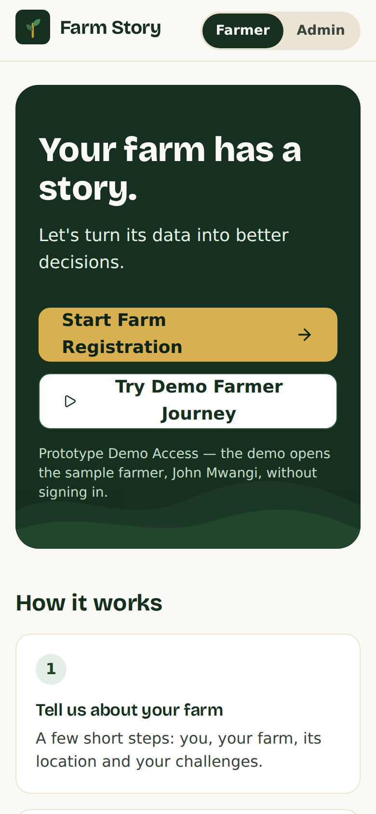
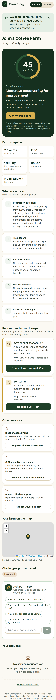
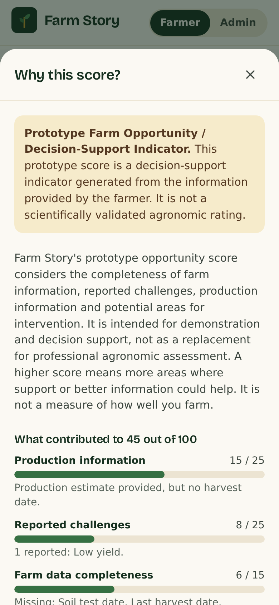

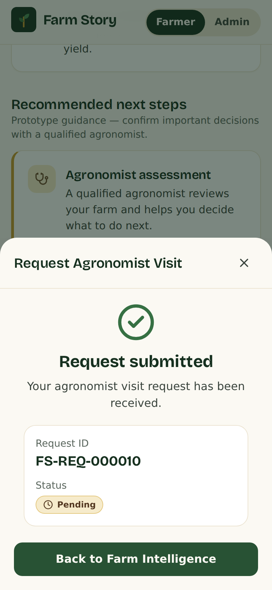
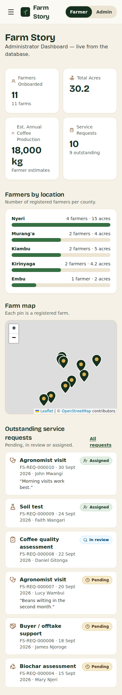
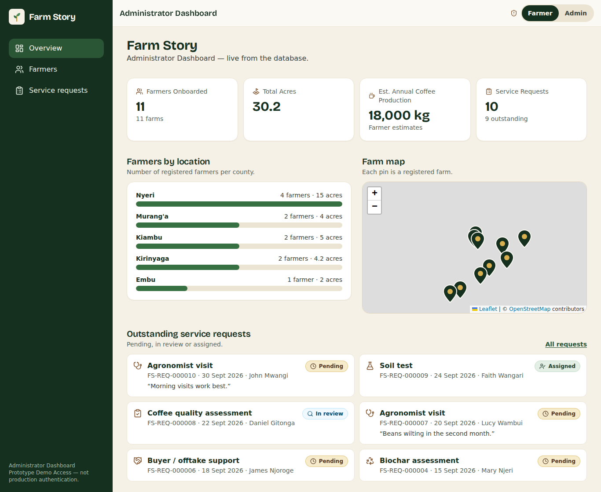
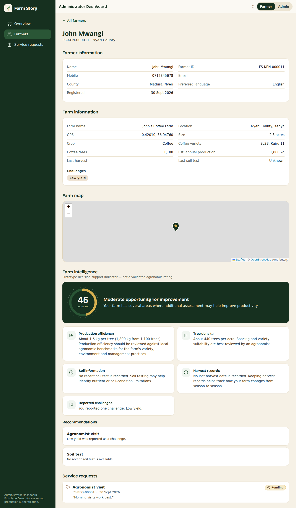
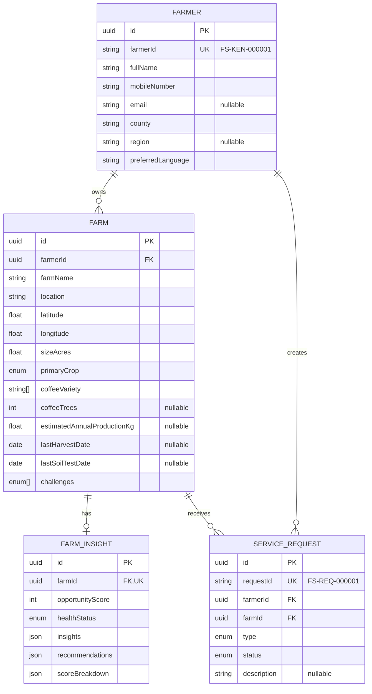

# Farm Story

A mobile-first agricultural platform prototype for African smallholder farmers: register a farm, see a transparent **Farm Opportunity** score, ask an AI assistant about your farm, and request an agricultural service. Administrators get a live, database-backed dashboard.

> **Prototype.** The opportunity score is a rules-based decision-support indicator, not a validated agronomic rating. See [Known Limitations](#known-limitations).

## Overview

**Problem.** Smallholder farmers rarely have their farm data in one place, and agronomists, buyers and service providers can't easily see who needs what. Farm Story turns a five-step registration into a farm profile, a clear explanation of where support could help, and a one-tap way to request a service.

**Vertical slice built:**

```text
Farmer → Farm → Location → Challenges → Review → Farm Intelligence → Recommendations → Take Action → Admin Dashboard
```

Everything in the prototype is real end to end: React → REST API → Prisma → PostgreSQL. No dashboard number is hardcoded.

## Features

**Farmer**
- Welcome screen with **Start Farm Registration** and **Try Demo Farmer Journey** (opens seeded John Mwangi)
- 5-step wizard (Farmer, Farm, Location, Challenges, Review) with per-step Zod validation, Back/Continue, and a draft saved in the browser so a refresh never loses answers
- Human-readable Farmer ID (`FS-KEN-000001`) shown after registration
- Coffee-only fields (varieties, tree count) appear only when Coffee is chosen
- Leaflet + OpenStreetMap: tap the map, drag the marker, type coordinates, or use geolocation (denial handled gracefully)
- Farm Intelligence: score ring, farm snapshot, "What we noticed", **My Farm Action Plan**, **Why this score?** dialog
- **My Farm Action Plan:** the engine's recommendations as a prioritised, numbered list with reasons and a one-tap request button per step
- **Ask Farm Story** AI assistant (server-side, graceful when unavailable) that can explain the Action Plan
- **Installable, offline-ready app shell (PWA)** with an Online / Offline indicator and a locally saved onboarding draft
- Take Action → confirmation form → request ID (`FS-REQ-000021`) and status

**Administrator**
- KPI cards: farmers, total acres, estimated coffee production, service requests
- Farmers by location (bar list + map of farm markers)
- Searchable / filterable / paginated farmer table → farmer profile (farmer, farm, map, intelligence, requests)
- Service request list with status filter and status updates
- **Export CSV** of farmers and of service requests (real database data, respecting the current filters)

**Prototype Demo Access** (Farmer / Admin switcher) is clearly labelled as **not production authentication**.

## Screenshots

| Welcome | Farm Intelligence | Why this score? |
|---|---|---|
|  |  |  |

| AI unavailable state | Request submitted | Admin (mobile) |
|---|---|---|
|  |  |  |




*(Map tiles appear grey in these captures because they were taken in a sandbox without access to OpenStreetMap.)*

## Architecture

```text
React (Vite) ──REST──> NestJS ──Prisma──> PostgreSQL
                          ├── FarmInsightEngine  (deterministic rules → score, insights, recommendations)
                          │      └── Action Plan (derived view of the recommendations; no new rules)
                          ├── AiService ──> AiProvider (explains the score + Action Plan; optional, server-side only)
                          └── CSV export (farmers, service requests)

Browser: service worker caches the app shell; onboarding draft lives in localStorage.
```

**Why a modular monolith.** One deployable, one database transaction boundary, and one team-sized codebase is the fastest route to a reliable prototype. Modules (`farmer`, `farm`, `insight`, `service-request`, `ai`, `dashboard`, `prisma`) have clear boundaries, so high-load domains can be extracted later without a rewrite (see [Scalability](#scalability)). Microservices would add operational cost with no benefit at this size.

**Key design decisions**
- **The AI never computes the score.** The engine is pure TypeScript with no dependencies; the AI only explains and advises on top of stored data.
- **One current insight per farm**, upserted on regeneration (no duplicate rows; history is not kept, deliberately).
- **Safe IDs.** `FS-KEN-…` / `FS-REQ-…` come from a single atomic `INSERT … ON CONFLICT DO UPDATE … RETURNING` counter, so concurrent registrations can't collide (verified with 10 parallel requests). UUIDs remain the internal primary keys.
- **Consistent API envelope** `{ success, message, data }` / `{ success:false, message, error }` with friendly per-field validation messages.
- **The service request is checked server-side** to make sure the farm belongs to the farmer.
- **Admin routes and Leaflet are code-split** so farmers on slow connections don't download them.

## Technology Stack

| Layer | Choice |
|---|---|
| Frontend | React 19, Vite, TypeScript, Tailwind CSS 4, React Router, TanStack Query, React Hook Form + Zod, Lucide, Leaflet / React Leaflet |
| Backend | NestJS 11, TypeScript, Prisma 6, PostgreSQL 16, class-validator, Swagger |
| AI | Anthropic API behind an `AiProvider` interface |
| Maps | OpenStreetMap (no paid key) |

The UI components are hand-built on Tailwind (accessible native `<dialog>`, labelled fields, visible focus) instead of shadcn/ui, to keep the dependency footprint small for low-bandwidth users.

## Project Structure

```text
farm-story/
├── docker-compose.yml          # PostgreSQL only
├── backend/
│   ├── prisma/                 # schema.prisma, migrations/, seed.ts
│   └── src/
│       ├── farmer/  farm/  insight/  service-request/  ai/  dashboard/  prisma/  common/
│       └── insight/farm-insight.engine.ts   # the rules engine
└── frontend/src/
    ├── pages/{farmer,admin}/   layouts/   components/   api/   lib/   schemas/   types/
```

## Database Structure



Indexes: `Farmer(county, createdAt)`, `Farm(farmerId, primaryCrop, createdAt)`, `ServiceRequest(farmerId, farmId, status, createdAt)`. Challenges use a PostgreSQL enum array for simplicity. `lastSoilTestDate` is an addition to the brief's field list, needed for the soil-test rule.

## Farmer Journey

Welcome → **1 Farmer** → **2 Farm** → **3 Location** → **4 Challenges** → **5 Review** (nothing is saved until the farmer confirms) → Farm Intelligence → Take Action → optional AI assistant. "Insights" is deliberately *not* a data-entry step.

## Farm Intelligence Engine

`backend/src/insight/farm-insight.engine.ts`: deterministic, documented, and configured from one object (`ENGINE_CONFIG`).

**Score = sum of five dimensions (max 100).** Higher means *more opportunity for support*, not "worse farming".

| Dimension | Max | How points are earned |
|---|---|---|
| Production information | 25 | 25 if no production estimate; 15 if no harvest date; 10 if complete |
| Reported challenges | 25 | Per challenge (low yield 8, pests 7, soil 6, water 6, buyers 5, finance 5, input costs 4), capped |
| Farm data completeness | 15 | Share of tracked fields missing (soil date, harvest date, production, and for coffee: trees, variety) |
| Tree / farm information | 15 | Baseline 6, +5 per missing coffee detail |
| Potential intervention | 20 | 5 per Farm Story service the rules trigger |

Status: ≤34 lower opportunity · 35–64 moderate · ≥65 high.

**Recommendation rules**
- No recent soil test (none, or older than 24 months) → **Soil testing**
- Low yield / pests / water → **Agronomist assessment** (pests: diagnose before treatment)
- Soil quality → **Soil test + Biochar assessment**
- Input costs → **Soil test** (know your soil before buying inputs)
- Buyer access → **Buyer / offtake support** (+ **Coffee quality assessment** for coffee)
- Multiple challenges → higher score and multiple recommendations; reasons for the same service are merged.

**Production per tree** = annual kg ÷ trees (guarded against 0/missing). It is reported as a neutral metric with the benchmark note. It is never called good or bad.

Every score has a breakdown (`scoreBreakdown`), the information available/missing, and the rules that fired, all shown in **Why this score?**.

## AI Assistant

- `POST /api/ai/farm-question` builds a **minimal context** from stored data (first name, county, crop, size, production, challenges, score, insights). **No phone, email or surname is sent.**
- System prompt: cautious, no invented weather/soil/market/satellite data, says plainly when data is missing, refers serious disease or chemical decisions to an agronomist, **no specific pesticide/fertiliser products or rates**, ignores instructions inside the question that try to change its rules.
- Server-side only; timeout 20 s with one retry. Provider is swappable via the `AiProvider` interface (one line in `AiModule`).
- If `AI_API_KEY` is missing or the provider fails: *"The Farm Story assistant is temporarily unavailable. Your farm information and recommendations are still available."* with a Retry button. The rest of the app is unaffected.
- The answer is rendered as plain text (paragraphs and bullets) with no HTML injection.

## API Endpoints

Swagger UI: `http://localhost:4000/api/docs`

| Method | Path | Purpose |
|---|---|---|
| POST | `/api/farmers` | Register farmer (generates `FS-KEN-…`) |
| GET | `/api/farmers` | List: `search`, `county`, `crop`, `page`, `pageSize` |
| GET | `/api/farmers/export` | CSV download (same `search`, `county`, `crop` filters as the list) |
| GET | `/api/farmers/:id` | Farmer + farms + insight + requests (UUID or `FS-KEN-…`) |
| POST | `/api/farms` | Register farm (insight generated automatically) |
| GET / PATCH | `/api/farms/:id` | Get / update (update regenerates insight) |
| GET | `/api/farms/:id/insight` | Current insight |
| POST | `/api/farms/:id/insight/generate` | Regenerate (upsert) |
| POST | `/api/service-requests` | Create request (`FS-REQ-…`, status PENDING) |
| GET | `/api/service-requests` | List: `status`, `farmerId`, `outstanding` |
| GET | `/api/service-requests/export` | CSV download (`status` or `outstanding` filter) |
| GET | `/api/service-requests/:id` | Get one |
| PATCH | `/api/service-requests/:id/status` | Update status |
| POST | `/api/ai/farm-question` | Ask the assistant |
| GET | `/api/dashboard/summary` `/locations` `/recent-farmers` `/service-requests` | Admin data |

## Environment Variables

`backend/.env.example` (copy to `.env`):

| Variable | Purpose |
|---|---|
| `DATABASE_URL` | PostgreSQL connection string (matches docker-compose) |
| `PORT` | API port (default 4000) |
| `FRONTEND_URL` | Allowed CORS origin(s), comma-separated |
| `AI_API_KEY` | Anthropic key (optional; assistant degrades gracefully without it) |
| `AI_MODEL` | Model ID, e.g. `claude-sonnet-4-6` |
| `NODE_ENV` | `development` / `production` |

`frontend/.env.example`: `VITE_API_URL` is empty in development (Vite proxies `/api`); set to the API origin in production. No secrets ever reach the frontend.

## Local Development

Prerequisites: Node 20+, Docker.

```bash
# 1. Database
docker compose up -d

# 2. Backend
cd backend
cp .env.example .env            # add AI_API_KEY if you want the assistant
npm install
npx prisma generate
npx prisma migrate deploy       # applies prisma/migrations
npm run seed                    # John Mwangi + 9 demo farmers
npm run start:dev               # http://localhost:4000/api (docs at /api/docs)

# 3. Frontend (new terminal)
cd frontend
npm install
npm run dev                     # http://localhost:5173
```

Open the app and click **Try Demo Farmer Journey**, or **Start Farm Registration** (use **Fill demo data** on step 1 to enter John Mwangi's details). Switch to **Admin** with the Prototype Demo Access toggle.

## Database Setup

`npx prisma migrate deploy` applies the checked-in migration. `npm run seed` resets the demo data (it is destructive; use it on a dev database only). Seeded values are fictional demo data, not real datasets. Insights are produced by the real engine, and ID counters continue after the seeded IDs.

## Running the Application

| Command | Where | What |
|---|---|---|
| `npm run start:dev` | backend | API with reload |
| `npm test` | backend | Jest unit tests |
| `npm test` | frontend | Onboarding draft persistence tests (Node's built-in test runner, no extra dependency) |
| `npm run build && npm run start:prod` | backend | Production build |
| `npm run dev` / `npm run build` | frontend | Dev server / production bundle |

**Tests** (29, business logic first): engine (low yield, missing/old soil test, production-per-tree incl. 0 trees, score range 0–100 and weights sum to 100, multiple challenges, determinism), farmer validation, farm validation (size, coordinates, negatives, enums), service-request creation (valid, invalid, farm/farmer ownership, 404s).

## Deployment

Frontend: any static host (`npm run build` → `dist/`) with `VITE_API_URL` set. Backend: any Node host or container with `DATABASE_URL`, `FRONTEND_URL`, `AI_API_KEY`, `AI_MODEL`; run `prisma migrate deploy` on release. Use a managed PostgreSQL. Replace the demo role switcher with real authentication before any real use.

## Scalability

**Evolution path (no premature microservices).**
1. **Modular monolith** (this prototype): React + NestJS + PostgreSQL.
2. **Scale the infrastructure:** indexing, connection pooling (PgBouncer), read replicas, Redis caching, object storage, background queues, CDN, monitoring, horizontal API scaling.
3. **Extract only where load justifies it:** AI recommendation, weather, satellite, payments, marketplace, notifications, each as its own service, using async processing for satellite/weather ingestion, batch AI, notifications, reports and analytics. Growth in users alone does not require microservices.

**100,000 farmers.** This is comfortable for one well-indexed Postgres. Needs: connection pooling, cursor pagination on lists, cached dashboard aggregates (Redis or materialised views refreshed on a schedule), and stateless API instances behind a load balancer.

**Millions of farm records.** Proper indexes and query plans; pagination everywhere (cursor-based for large tables); partitioning only where justified (e.g. by time for events/insights history); read replicas for admin/analytics; archival of old requests; object storage for files; analytics read models kept separate from the transactional schema.

**Large maps (100,000+ farms).** The prototype's admin map endpoint (`GET /api/dashboard/locations`) deliberately returns every farm marker in one response, which is simple and fine for a demo-sized dataset. It would not survive 100,000+ farms: the payload, the database query and the browser's marker rendering would all become bottlenecks. A production system would optimise by geographic viewport and zoom level instead of shipping every record:
- **Viewport / bounding-box queries:** the client sends the visible bounds and zoom; the server returns only farms inside them (backed by a spatial index such as PostGIS `GIST`).
- **Server-side filtering and pagination:** filter by county, crop, status or challenge on the server, and page or cap results rather than returning every farm record.
- **Clustering and aggregation:** at low zoom return counts or grid/geohash aggregates (e.g. "312 farms in this cell"), and only individual markers once zoomed in.
- **Vector tiles where appropriate:** for very dense layers, serve pre-generated or on-demand vector tiles (e.g. PostGIS `ST_AsMVT`) so the browser renders only what is on screen.

The prototype intentionally keeps the map simple; the production design would make rendering cost depend on what is visible, not on the total number of farms.

**Weather / satellite.**
```text
External providers → Ingestion workers → Queue → Processing pipeline → Farm environmental data → Recommendation engine → Farmer / Admin
```
Ingestion never blocks normal API requests.

**AI at scale.**
```text
Farm data → Feature extraction → Recommendation service → AI model/API → Recommendation store → Farmer
```
Cache reusable recommendations, process expensive work asynchronously, and never call a model on a dashboard page load.

**AI rate limiting and cost control (not implemented).** The prototype has no per-user AI quotas, no rate limiting, no cost controls and no detailed AI usage monitoring, so anyone who can reach the API can trigger model calls against the configured key. Production would add:
- authenticated access to the AI endpoint;
- per-user and per-application quotas;
- rate limiting (per user and per IP) at the API gateway or application layer;
- usage monitoring: tokens, cost, latency and error rates per user, with alerts;
- cost controls such as spend caps, input/output token limits and a kill switch;
- potentially asynchronous AI processing (queue + worker) for expensive or bulk workflows.

**Payments (future, out of scope).** Separate payment service, provider integration, webhook processing, transaction records, idempotency keys, reconciliation and audit logs.

**Buyer / offtake marketplace (future, out of scope).** Kept outside the core farm-management domain: produce → availability → buyer → order → offtake transaction → payment → fulfilment.

**Auditability (future).** Audit logs, role-based permissions, transaction and service-request history, AI recommendation history and data-change history. The prototype keeps only the current insight and current request status.

## Offline / PWA

**What the prototype does.**
- **Installable PWA:** web app manifest, icons (including maskable) and a service worker. Browsers that support it offer "Install app".
- **Offline application shell:** the service worker precaches the built HTML, JS, CSS and icons, so the app opens and navigates without a connection. Navigations are network-first with the cached shell as fallback; hashed assets are cache-first. It is registered in production builds only (not in `vite dev`).
- **Online / offline awareness:** a header indicator shows **Online** or **Offline — your draft is saved on this device**. During onboarding the form also says *"You're offline. Your draft is saved on this device."* and, when the connection returns, *"You're back online."*
- **Locally persisted onboarding draft:** every change is saved to `localStorage` (`lib/draft.ts`, unit-tested), so a dropped connection, refresh or closed tab does not lose answers. The draft is cleared after a successful registration.

**What it deliberately does not do.** The API, map tiles and all data are never cached or queued. **Farm registration cannot be submitted offline**: the farmer finishes the form when connectivity returns and submits normally (a failed save never registers the farmer twice). Offline service requests, background sync and conflict handling are not implemented.

**Future production enhancements.** **IndexedDB**-backed offline entity storage (farmers, farms, requests), **queued submissions**, **background synchronisation** (Background Sync API with a fallback), **conflict resolution** (server-generated IDs, idempotency keys, last-write-wins per field with review for true conflicts), and **retry policies** (exponential backoff with user-visible status per queued item). A service-worker update prompt ("A new version is available") would also be added.

## Data Export

Admins get an **Export CSV** button on the **Farmers** and **Service requests** pages.
- **Farmers CSV** (`GET /api/farmers/export`): Farmer ID, Full Name, Mobile, Email, County, Preferred Language, Farm Name, Farm Size, Primary Crop, Coffee Variety, Coffee Trees, Estimated Annual Production, Last Harvest Date, Challenges, Opportunity Score, Insight Status, Created At. One row per farm.
- **Service requests CSV** (`GET /api/service-requests/export`): Request ID, Farmer ID, Farmer Name, Farm Name, Request Type, Status, Description, Created At, Updated At.
- Data is read from PostgreSQL on the server at download time, so it always reflects the current database. The export **respects the filters currently applied** (farmer search/county/crop; request status).
- Implementation is a ~30-line RFC 4180 writer (no dependency), UTF-8 with BOM so Excel opens it correctly, and values that could be read as spreadsheet formulas are neutralised. Exports are capped at 10,000 rows; beyond that a production system would stream or generate exports as background jobs.
- Prototype note: the export endpoints are open like the rest of the API. Production would restrict them to authenticated administrators and audit-log each export.

## Farm Action Plan

**My Farm Action Plan** turns the engine's recommendations into a numbered, prioritised list on the Farm Intelligence page, each with its reason and a button that opens the existing service-request flow.
- **The deterministic `FarmInsightEngine` remains authoritative.** The plan is a derived view (`insight/action-plan.ts`) of the engine's recommendations; it adds no rules. Each service step is one engine recommendation with the engine's own reason. If the engine returns no recommendations, there is no plan: nothing is invented to fill slots.
- **Priority:** services backed by more reported reasons come first; ties keep the engine's order. A final **Review production efficiency** step (no button) appears only when the engine has calculated a production metric, and uses the engine's benchmark note; it makes no judgement about whether production is good or bad.
- **AI is an explanation and conversation layer only.** Ask Farm Story (the existing assistant, not a new chatbot) now receives the farm context, score, score breakdown, insights, recommendations and action plan on the server, and the suggested question *"Why are these my recommended next steps?"* explains them in plain language. The prompt forbids changing the score or plan, inventing soil, weather, satellite or market data, claiming certainty, or saying a service has been booked or completed. Personal identifiers (surname, phone, email) are never sent. The API key never reaches the browser.

## Known Limitations

- The opportunity score is a prototype rules engine, not a validated agronomic rating.
- AI advice is general decision support and must be validated by professionals.
- No real weather, satellite, soil-lab or market-price integration.
- No production authentication (role switcher only); no per-user authorisation on the API.
- No AI rate limiting, per-user quotas, cost controls or AI usage monitoring (see [Scalability](#scalability)).
- The admin map returns all farm markers in one response; viewport queries, clustering and pagination would be needed beyond demo-scale data.
- No real payments and no buyer marketplace.
- Map tiles depend on OpenStreetMap availability (the form still works with typed coordinates).
- One insight per farm (no history); no audit log.
- Offline support is limited to the app shell and a local onboarding draft; offline submissions, sync and conflict resolution are not implemented. A service worker only takes effect on production builds served over HTTPS (or localhost).
- CSV export endpoints are not access-controlled (no production authentication) and are capped at 10,000 rows.
- The Action Plan explanation path was verified with a mocked AI provider only; it has not been exercised against a live model.
- Seed data is fictional. Farm-level "soil test recent" uses a 24-month prototype threshold, not an agronomic standard.
- The backend uses Prisma's engine-less client with the `pg` driver adapter (`engineType = "client"`), which is what the checked-in setup was verified against.

## AI-Assisted Development

AI-assisted development tools were used to accelerate:

- project scaffolding
- component generation
- boilerplate code
- debugging
- documentation
- code review assistance

The architecture, database design, product decisions, recommendation logic, AI workflow, validation and final implementation were reviewed and directed by the developer.
