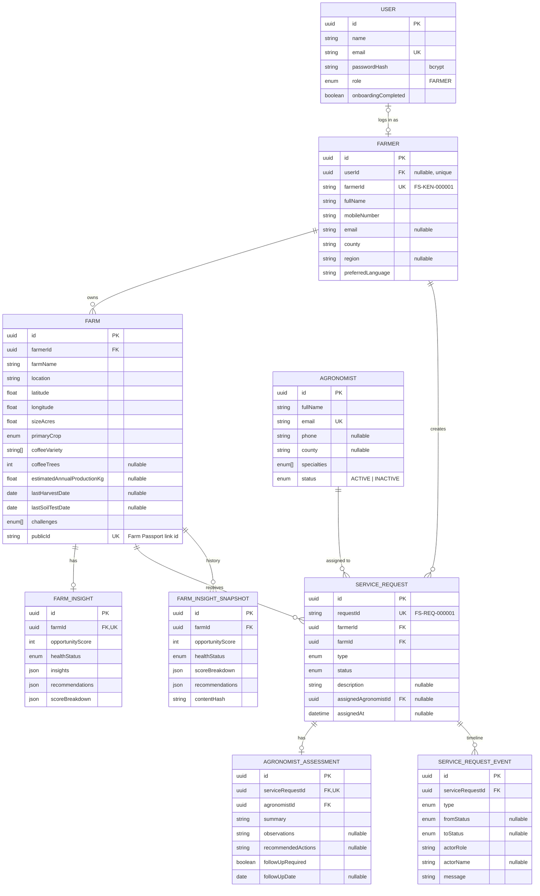

# Farm Story

A mobile-first agricultural platform prototype for African smallholder farmers: register a farm, see a transparent **Farm Opportunity** score, ask an AI assistant about your farm, and request an agricultural service. Administrators get a live, database-backed dashboard.

> **Prototype.** The opportunity score is a rules-based decision-support indicator, not a validated agronomic rating. See [Known Limitations](#known-limitations).

## Overview

**Problem.** Smallholder farmers rarely have their farm data in one place, and agronomists, buyers and service providers can't easily see who needs what. Farm Story turns a five-step registration into a farm profile, a clear explanation of where support could help, and a one-tap way to request a service.

**Vertical slice built:**

```text
Farmer → Farm → Location → Challenges → Review → Farm Intelligence → Recommendations → Take Action → Admin Dashboard
```

Everything in the prototype is real end to end: React → REST API → Prisma → PostgreSQL. No dashboard number is hardcoded.

## Features

**Farmer**

- Welcome screen with **Start Farm Registration** (create an account, then onboarding), **Log in**, and **Try Demo Farmer Journey** (opens seeded John Mwangi without signing in)
- **Farmer accounts:** sign up, log in / out, continue unfinished onboarding later, a lightweight **My Farm** dashboard and a farmer navigation bar (see [Authentication](#authentication))
- 5-step wizard (Farmer, Farm, Location, Challenges, Review) with per-step Zod validation, Back/Continue, and a draft saved in the browser so a refresh never loses answers
- Human-readable Farmer ID (`FS-KEN-000001`) shown after registration
- Coffee-only fields (varieties, tree count) appear only when Coffee is chosen
- Leaflet + OpenStreetMap: tap the map, drag the marker, type coordinates, or use geolocation (denial handled gracefully)
- Farm Intelligence: score ring, farm snapshot, "What we noticed", **My Farm Action Plan**, **Why this score?** dialog
- **My Farm Action Plan:** the engine's recommendations as a prioritised, numbered list with reasons and a one-tap request button per step
- **Ask Farm Story** AI assistant (server-side, graceful when unavailable) that can explain the Action Plan
- **Installable, offline-ready app shell (PWA)** with an Online / Offline indicator and a locally saved onboarding draft
- Take Action → confirmation form → request ID (`FS-REQ-000021`) and status
- **Request timeline** and shared agronomist assessment for each request, **Farm Intelligence History** (score chart and data-only change explanations) and a public, privacy-safe **Farm Passport** with QR code

**Administrator**

- KPI cards: farmers, total acres, estimated coffee production, service requests
- Farmers by location (bar list + map of farm markers)
- Searchable / filterable / paginated farmer table → farmer profile (farmer, farm, map, intelligence, requests)
- Service request list with status filter and status updates
- **Agronomists** management, assignment from a request detail page (with timeline), and an "Assigned to" column
- **Export CSV** of farmers and of service requests (real database data, respecting the current filters)

**Agronomist Workspace** (`/agronomist`): KPI cards, assigned requests, request detail with farm context, assessment form, completion and timeline. See [Agronomist Workflow](#agronomist-workflow).

**Prototype Demo Access** (Farmer / Agronomist / Admin switcher) is clearly labelled as **not production authentication**. Admin and Agronomist sign-in are intentionally not implemented.

## Screenshots

All captures are from the running app with the seeded demo data.

### Farmer (mobile)

| Welcome                                            | Log in                                          | Onboarding                                               |
| -------------------------------------------------- | ----------------------------------------------- | -------------------------------------------------------- |
|  |  |  |

| My Farm                                                     | Farm Intelligence                                                 | Why this score?                                             |
| ----------------------------------------------------------- | ----------------------------------------------------------------- | ----------------------------------------------------------- |
|  |  |  |

| Action Plan                                                | Intelligence History                               | Farm Passport + QR                                              |
| ---------------------------------------------------------- | -------------------------------------------------- | --------------------------------------------------------------- |
|  |  |  |

| Ask Farm Story (AI unavailable state)            | Request form                                                 | Request submitted                                                  |
| ------------------------------------------------ | ------------------------------------------------------------ | ------------------------------------------------------------------ |
|  |  |  |

| Request timeline                                             | Public Farm Passport                                               |
| ------------------------------------------------------------ | ------------------------------------------------------------------ |
|  |  |

### Administrator (desktop)


### Agronomist workspace


| Agronomist (mobile)                                                       | Admin (mobile)                                                  |
| ------------------------------------------------------------------------- | --------------------------------------------------------------- |
|  |  |

_(Map tiles appear grey in these captures because they were taken in a sandbox without access to OpenStreetMap.)_

## Architecture

```text
React (Vite) ──REST──> NestJS ──Prisma──> PostgreSQL
                          ├── AuthModule (bcrypt + JWT in HTTP-only cookie; farmer ownership checks)
                          ├── FarmInsightEngine  (deterministic rules → score, insights, recommendations)
                          │      ├── Action Plan (derived view of the recommendations; no new rules)
                          │      └── FarmInsightSnapshot history (stored only when the result changes)
                          ├── ServiceRequest workflow (state machine + immutable timeline events)
                          ├── AgronomistModule (profiles, assignment, assessments, workspace)
                          ├── PassportModule (public, allow-listed Farm Passport by random link)
                          ├── AiService ──> AiProvider (explains the score + Action Plan; optional, server-side only)
                          └── CSV export (farmers, service requests)

Browser: service worker caches the app shell; onboarding draft lives in localStorage.
```

**Why a modular monolith.** One deployable, one database transaction boundary, and one team-sized codebase is the fastest route to a reliable prototype. Modules (`auth`, `farmer`, `farm`, `insight`, `service-request`, `agronomist`, `passport`, `ai`, `dashboard`, `prisma`) have clear boundaries, so high-load domains can be extracted later without a rewrite (see [Scalability](#scalability)). Microservices would add operational cost with no benefit at this size.

**Key design decisions**

- **The AI never computes the score.** The engine is pure TypeScript with no dependencies; the AI only explains and advises on top of stored data.
- **One current insight per farm**, upserted on regeneration, plus an append-only **snapshot history** written only when the content hash changes (no duplicate snapshots).
- **Explicit request state machine.** `PENDING → IN_REVIEW → ASSIGNED → COMPLETED` (`CANCELLED` from any open state). Assignment and completion go through dedicated endpoints; completion requires an assessment; compare-and-set updates return `409` on conflicting changes. Every transition writes an immutable timeline event.
- **Privacy-safe sharing.** The public Farm Passport uses a random UUID (never the internal id) and an allow-list serializer; the owner can revoke the link.
- **Safe IDs.** `FS-KEN-…` / `FS-REQ-…` come from a single atomic `INSERT … ON CONFLICT DO UPDATE … RETURNING` counter, so concurrent registrations can't collide (verified with 10 parallel requests). UUIDs remain the internal primary keys.
- **Consistent API envelope** `{ success, message, data }` / `{ success:false, message, error }` with friendly per-field validation messages.
- **The service request is checked server-side** to make sure the farm belongs to the farmer.
- **Admin routes and Leaflet are code-split** so farmers on slow connections don't download them.

## Technology Stack

| Layer    | Choice                                                                                                                           |
| -------- | -------------------------------------------------------------------------------------------------------------------------------- |
| Frontend | React 19, Vite, TypeScript, Tailwind CSS 4, React Router, TanStack Query, React Hook Form + Zod, Lucide, Leaflet / React Leaflet |
| Backend  | NestJS 11, TypeScript, Prisma 6, PostgreSQL 16, class-validator, Swagger                                                         |
| AI       | Anthropic API behind an `AiProvider` interface                                                                                   |
| Auth     | bcryptjs, JWT (`@nestjs/jwt` + Passport) in an HTTP-only cookie                                                                  |
| Other    | `qrcode` (client-side QR for the Farm Passport), PWA service worker                                                              |
| Testing  | Jest (backend), Node test runner (frontend), Playwright scripted browser checks                                                  |
| Maps     | OpenStreetMap (no paid key)                                                                                                      |

The UI components are hand-built on Tailwind (accessible native `<dialog>`, labelled fields, visible focus) instead of shadcn/ui, to keep the dependency footprint small for low-bandwidth users.

## Project Structure

```text
farm-story/
├── docker-compose.yml          # PostgreSQL only
├── backend/
│   ├── prisma/                 # schema.prisma, migrations/, seed.ts
│   └── src/
│       ├── auth/  farmer/  farm/  insight/  service-request/  agronomist/  passport/  ai/  dashboard/  prisma/  common/
│       ├── insight/farm-insight.engine.ts   # the rules engine
│       ├── insight/insight-history.ts       # data-only change explanations
│       └── service-request/request-workflow.ts   # state machine
└── frontend/src/
    ├── pages/{farmer,admin,agronomist}/  PassportPage.tsx   layouts/   components/   api/   lib/   schemas/   types/
```

## Database Structure



Indexes: `Farmer(county, createdAt)`, `Farm(farmerId, primaryCrop, createdAt)`, `ServiceRequest(farmerId, farmId, status, createdAt, assignedAgronomistId+status)`, `ServiceRequestEvent(serviceRequestId, createdAt)`, `FarmInsightSnapshot(farmId, createdAt)`. Challenges use a PostgreSQL enum array for simplicity. `lastSoilTestDate` is an addition to the brief's field list, needed for the soil-test rule.

## Farmer Journey

Welcome → **Create account** → **1 Farmer** → **2 Farm** → **3 Location** → **4 Challenges** → **5 Review** (nothing is saved until the farmer confirms) → Farm Intelligence → Take Action → optional AI assistant. "Insights" is deliberately _not_ a data-entry step.

After a service request is submitted the loop continues: **admin reviews and assigns an agronomist → agronomist submits an assessment and completes the request → the farmer sees the status, timeline and shared assessment**. The farmer can also review their **Intelligence History** and share a **Farm Passport** link or QR code.

## Authentication

**What exists.** Farmers can **sign up, log in, log out and come back later**. After sign-up they go straight into the existing onboarding flow (no second onboarding system). If they stop part-way, `User.onboardingCompleted` stays `false`, the next login opens **Continue Onboarding** (their answers are saved on the device, per account), and the dashboard stays locked until the farm is saved. Once the farm exists, `onboardingCompleted` becomes `true` and login goes to the **My Farm** dashboard.

| State                              | Where the farmer lands  |
| ---------------------------------- | ----------------------- |
| Logged out                         | `/login` (or `/signup`) |
| Logged in, onboarding not finished | `/farmer/onboarding`    |
| Logged in, onboarding finished     | `/farmer/dashboard`     |

Farmer routes: `/farmer/onboarding`, `/farmer/dashboard`, `/farmer/intelligence`, `/farmer/actions`, `/farmer/ask`, `/farmer/requests`.

**How it works.**

- **Passwords** are hashed with **bcrypt** (`bcryptjs`) and never returned or logged; there is one account per unique email, and credentials live only on `User` (never on `Farmer`).
- **JWT** (`@nestjs/jwt` + Passport) carried in an **HTTP-only, `SameSite=Lax` cookie** (`Secure` in production). The browser's JavaScript cannot read it. Tokens last 7 days; there are no refresh tokens.
- Login errors are generic (`Invalid email or password.`) for both an unknown email and a wrong password.
- **Data model:** `User { id, name, email (unique), passwordHash, role (FARMER), onboardingCompleted }` with an optional one-to-one `Farmer.userId`. Seeded demo farmers have no user. Migration: `prisma/migrations/20261001000000_add_user_auth`.

**Farmer ownership.** The server decides who a request belongs to, not the browser. When a farmer is logged in:

- saving farmer details links the record to **their** account (resuming onboarding updates the same record, never creates a second one);
- creating a farm or a service request uses **their** farmer, whatever `farmerId` the browser sends;
- reading or updating a farmer, farm, insight, service request or AI answer that belongs to someone else returns **403**, and their request list is always scoped to their own requests;
- the internal `userId` is never included in API responses.

**Demo logins** (created by `npm run seed`, password `Password123!`): `john@example.com` (John Mwangi, onboarding complete) and `grace.wanjiru@example.com`. Log in as one and try opening the other's farm id to see the 403.

**What is intentionally not built.** Admin / Agronomist authentication (the agronomist selector is demo access only), email verification, password reset, MFA / OAuth / SMS, refresh tokens, login rate limiting and account lockout. These are future production features.

**Prototype Demo Access — not production authentication.** The Farmer / Agronomist / Admin switcher is clearly labelled; the agronomist workspace uses a "viewing as" selector, not a login. Because admin sign-in is out of scope, the admin endpoints (`/api/dashboard/*`, farmer list, CSV exports, request status updates, agronomist management and assignment, the agronomist workspace) and requests with **no** session remain open, exactly as before, so the admin demo and "Try Demo Farmer Journey" keep working. Ownership is therefore enforced for **logged-in farmers**; locking the remaining endpoints down is the first job once admin authentication exists. Cookie sessions rely on `SameSite` plus a CORS allow-list for CSRF protection; a production deployment would add CSRF tokens if cross-site cookies (`COOKIE_SAME_SITE=none`) are used.

## Farm Intelligence Engine

`backend/src/insight/farm-insight.engine.ts`: deterministic, documented, and configured from one object (`ENGINE_CONFIG`).

**Score = sum of five dimensions (max 100).** Higher means _more opportunity for support_, not "worse farming".

| Dimension               | Max | How points are earned                                                                                 |
| ----------------------- | --- | ----------------------------------------------------------------------------------------------------- |
| Production information  | 25  | 25 if no production estimate; 15 if no harvest date; 10 if complete                                   |
| Reported challenges     | 25  | Per challenge (low yield 8, pests 7, soil 6, water 6, buyers 5, finance 5, input costs 4), capped     |
| Farm data completeness  | 15  | Share of tracked fields missing (soil date, harvest date, production, and for coffee: trees, variety) |
| Tree / farm information | 15  | Baseline 6, +5 per missing coffee detail                                                              |
| Potential intervention  | 20  | 5 per Farm Story service the rules trigger                                                            |

Status: ≤34 lower opportunity · 35–64 moderate · ≥65 high.

**Recommendation rules**

- No recent soil test (none, or older than 24 months) → **Soil testing**
- Low yield / pests / water → **Agronomist assessment** (pests: diagnose before treatment)
- Soil quality → **Soil test + Biochar assessment**
- Input costs → **Soil test** (know your soil before buying inputs)
- Buyer access → **Buyer / offtake support** (+ **Coffee quality assessment** for coffee)
- Multiple challenges → higher score and multiple recommendations; reasons for the same service are merged.

**Production per tree** = annual kg ÷ trees (guarded against 0/missing). It is reported as a neutral metric with the benchmark note. It is never called good or bad.

Every score has a breakdown (`scoreBreakdown`), the information available/missing, and the rules that fired, all shown in **Why this score?**.

## AI Assistant

- `POST /api/ai/farm-question` builds a **minimal context** from stored data (first name, county, crop, size, production, challenges, score, insights). **No phone, email or surname is sent.**
- System prompt: cautious, no invented weather/soil/market/satellite data, says plainly when data is missing, refers serious disease or chemical decisions to an agronomist, **no specific pesticide/fertiliser products or rates**, ignores instructions inside the question that try to change its rules.
- Server-side only; timeout 20 s with one retry. Provider is swappable via the `AiProvider` interface (one line in `AiModule`).
- If `AI_API_KEY` is missing or the provider fails: _"The Farm Story assistant is temporarily unavailable. Your farm information and recommendations are still available."_ with a Retry button. The rest of the app is unaffected.
- The answer is rendered as plain text (paragraphs and bullets) with no HTML injection.

## API Endpoints

Swagger UI: `http://localhost:4000/api/docs`

| Method             | Path                                                                        | Purpose                                                                               |
| ------------------ | --------------------------------------------------------------------------- | ------------------------------------------------------------------------------------- |
| POST               | `/api/auth/register`                                                        | Create a farmer account, set the session cookie (`onboardingCompleted=false`)         |
| POST               | `/api/auth/login`                                                           | Log in (generic `Invalid email or password.` on failure)                              |
| POST               | `/api/auth/logout`                                                          | Clear the session cookie                                                              |
| GET                | `/api/auth/me`                                                              | The logged-in farmer (+ linked farmer/farm ids); 401 when logged out                  |
| POST               | `/api/farmers`                                                              | Register farmer (generates `FS-KEN-…`)                                                |
| GET                | `/api/farmers`                                                              | List: `search`, `county`, `crop`, `page`, `pageSize`                                  |
| GET                | `/api/farmers/export`                                                       | CSV download (same `search`, `county`, `crop` filters as the list)                    |
| GET                | `/api/farmers/:id`                                                          | Farmer + farms + insight + requests (UUID or `FS-KEN-…`)                              |
| POST               | `/api/farms`                                                                | Register farm (insight generated automatically)                                       |
| GET / PATCH        | `/api/farms/:id`                                                            | Get / update (update regenerates insight)                                             |
| GET                | `/api/farms/:id/insight`                                                    | Current insight                                                                       |
| GET                | `/api/farms/:id/insight/history`                                            | Stored snapshots + data-only explanation of each change                               |
| POST               | `/api/farms/:id/insight/generate`                                           | Regenerate (upsert)                                                                   |
| POST               | `/api/service-requests`                                                     | Create request (`FS-REQ-…`, status PENDING)                                           |
| GET                | `/api/service-requests`                                                     | List: `status`, `farmerId`, `outstanding`                                             |
| GET                | `/api/service-requests/export`                                              | CSV download (`status` or `outstanding` filter)                                       |
| GET                | `/api/service-requests/:id`                                                 | Get one                                                                               |
| PATCH              | `/api/service-requests/:id/status`                                          | Manual status change (admin): only `IN_REVIEW` / `CANCELLED`, along valid transitions |
| POST               | `/api/service-requests/:id/assign`                                          | Assign / reassign an active agronomist (admin)                                        |
| GET                | `/api/service-requests/:id/timeline`                                        | Lifecycle events (farmers: own requests only)                                         |
| GET / POST / PATCH | `/api/agronomists` `/:id`                                                   | List / add / update (incl. ACTIVE / INACTIVE) agronomists (admin)                     |
| GET                | `/api/agronomists/:id/dashboard`                                            | Workspace KPIs from real data                                                         |
| GET                | `/api/agronomists/:id/requests` `/:requestId`                               | Assigned requests / one request (403 if not theirs)                                   |
| POST               | `/api/agronomists/:id/requests/:requestId/assessment` `/complete`           | Submit assessment / complete request                                                  |
| GET                | `/api/passport/:publicId`                                                   | Public Farm Passport (allow-listed fields only)                                       |
| POST               | `/api/farms/:id/passport/reset`                                             | New public id; old link / QR stop working (owner)                                     |
| POST               | `/api/ai/farm-question`                                                     | Ask the assistant                                                                     |
| GET                | `/api/dashboard/summary` `/locations` `/recent-farmers` `/service-requests` | Admin data                                                                            |

## Environment Variables

`backend/.env.example` (copy to `.env`):

| Variable           | Purpose                                                                                                                                                |
| ------------------ | ------------------------------------------------------------------------------------------------------------------------------------------------------ |
| `DATABASE_URL`     | PostgreSQL connection string (matches docker-compose)                                                                                                  |
| `PORT`             | API port (default 4000)                                                                                                                                |
| `FRONTEND_URL`     | Allowed CORS origin(s), comma-separated                                                                                                                |
| `AI_API_KEY`       | Anthropic key (optional; assistant degrades gracefully without it)                                                                                     |
| `AI_MODEL`         | Model ID, e.g. `claude-sonnet-4-6`                                                                                                                     |
| `JWT_SECRET`       | Signs login tokens. **Required in production** (the API refuses to start without it); a clearly-labelled insecure fallback is used only in development |
| `COOKIE_SAME_SITE` | `lax` (default) or `none` for cross-site deployments (forces `Secure`)                                                                                 |
| `NODE_ENV`         | `development` / `production` (production makes the login cookie `Secure`)                                                                              |

`frontend/.env.example`: `VITE_API_URL` is empty in development (Vite proxies `/api`); set to the API origin in production. No secrets ever reach the frontend.

## Local Development

Prerequisites: Node 20+, Docker.

```bash
# 1. Database
docker compose up -d

# 2. Backend
cd backend
cp .env.example .env            # add AI_API_KEY if you want the assistant
npm install
npx prisma generate
npx prisma migrate deploy       # applies prisma/migrations
npm run seed                    # John Mwangi + 9 demo farmers, 2 demo logins, 4 agronomists, sample assessments, history snapshots; prints John's Farm Passport link
npm run start:dev               # http://localhost:4000/api (docs at /api/docs)

# 3. Frontend (new terminal)
cd frontend
npm install
npm run dev                     # http://localhost:5173
```

Open the app and click **Try Demo Farmer Journey** (no sign-in), **Log in** with a demo account, or **Start Farm Registration** to create your own account (use **Fill demo data** on step 1 to enter John Mwangi's details). Switch to **Agronomist** or **Admin** with the Prototype Demo Access toggle (pick who you are "viewing as" in the agronomist workspace).

## Database Setup

`npx prisma migrate deploy` applies the checked-in migration. `npm run seed` resets the demo data (it is destructive; use it on a dev database only). Seeded values are fictional demo data, not real datasets. Insights are produced by the real engine, and ID counters continue after the seeded IDs.

## Running the Application

| Command                               | Where    | What                                                                                                         |
| ------------------------------------- | -------- | ------------------------------------------------------------------------------------------------------------ |
| `npm run start:dev`                   | backend  | API with reload                                                                                              |
| `npm test`                            | backend  | Jest unit tests                                                                                              |
| `npm test`                            | frontend | Onboarding draft persistence and login/route-gating tests (Node's built-in test runner, no extra dependency) |
| `npm run build && npm run start:prod` | backend  | Production build                                                                                             |
| `npm run dev` / `npm run build`       | frontend | Dev server / production bundle                                                                               |

**Tests** (business logic first). Backend: **123 tests in 16 suites**; frontend: **16 Node tests**. Plus scripted Playwright browser checks for the new flow (42 checks) and farmer auth (47 checks), which are run by hand and are not part of `npm test`. Coverage areas:

- Engine: low yield, missing/old soil test, production-per-tree incl. 0 trees, score range 0–100, weights sum to 100, multiple challenges, determinism
- Farmer, farm and service-request validation and ownership (404/403 cases)
- Request workflow: allowed/blocked transitions, assign, assessment, completion, `409` conflicts, timeline events
- Agronomist service: create/update/deactivate, workspace queries, follow-ups due
- Insight snapshots (stored only on change) and `explainChange` wording
- Farm Passport: allow-listed fields, reset/revoke, unknown links
- Frontend: workflow helpers, onboarding draft, route gating

## Deployment

Frontend: any static host (`npm run build` → `dist/`) with `VITE_API_URL` set to the API origin. Backend: any Node host or container with `DATABASE_URL`, `FRONTEND_URL`, `AI_API_KEY`, `AI_MODEL`, `JWT_SECRET`; run `prisma migrate deploy` on release. Use a managed PostgreSQL.

**Example: Render**

1. Create a PostgreSQL instance; copy its internal connection string.
2. **Web Service** (root `backend`): build `npm install && npx prisma generate && npm run build`; start `npx prisma migrate deploy && npm run start:prod`. Set `DATABASE_URL`, `JWT_SECRET` (long random), `FRONTEND_URL` (the static site's URL), and optionally `AI_API_KEY` / `AI_MODEL`.
3. **Static Site** (root `frontend`): build `npm install && npm run build`; publish `dist`; set `VITE_API_URL` to the web service URL and add a rewrite of `/*` to `/index.html`.
4. Run `npm run seed` once (Render shell) only if you want demo data; it is destructive.
5. If the frontend and API are on different sites, set `COOKIE_SAME_SITE=none` (cookies are `Secure` in production).

Replace the demo role switcher with real admin and agronomist authentication before any real use.

## Agronomist Workflow

```text
PENDING ──► IN_REVIEW ──► ASSIGNED ──► COMPLETED        (any open state ──► CANCELLED)
```

1. A farmer submits a request (`REQUEST_CREATED` event).
2. An admin opens the request (`/admin/requests/:id`) and **assigns an active agronomist**. Assigning a `PENDING` request records both a review and the assignment. Reassigning is allowed until an assessment exists. Inactive agronomists keep existing work but cannot be chosen.
3. The agronomist opens `/agronomist` (KPI cards: **Assigned Requests, Pending Visits, Completed Visits, Follow-ups Due**, all counted from real rows) and the request detail page, which shows the farmer, farm, map, current insight and action plan.
4. They **submit an assessment** (summary, observations, suggested actions, optional follow-up date, which cannot be in the past). It is editable until completion.
5. They **complete** the request. Completion needs an assessment.

**State-machine safety** (`service-request/request-workflow.ts`, unit tested): the generic status endpoint can only set `IN_REVIEW` or `CANCELLED`; `ASSIGNED` and `COMPLETED` are reachable only through assign / complete. `COMPLETED` and `CANCELLED` are final. An agronomist can only act on requests assigned to them (403 otherwise). Status changes use a compare-and-set update, so two people acting at once cannot both succeed (409 with a clear message). The UI only offers transitions the API accepts.

**Timeline.** Every transition writes an append-only `ServiceRequestEvent` (type, from/to status, actor role/name, message, time). Farmers see their own request's timeline and shared assessment in a dialog; admins and agronomists see it on their detail pages.

**Follow-ups due** = assessments with a follow-up required whose date is overdue or within the next 7 days.

**Prototype access.** The agronomist workspace has no login. A "Viewing as" selector chooses the agronomist; it sits under the _Prototype Demo Access — not production authentication_ label.

## Farm Intelligence History

Each time the deterministic engine runs (farm created, farm updated, regenerated) a `FarmInsightSnapshot` is stored **only if the result changed** (content hash of score, status, dimension points, recommended services and available information), so repeated refreshes do not create duplicates. The current insight stays one row per farm; history lives in snapshots.

`GET /api/farms/:id/insight/history` returns snapshots (oldest first, last 50) and, for each, an explanation built by the pure function `explainChange`: which score dimensions moved, which information was added or removed, which suggested services appeared or disappeared. **Nothing in the explanation comes from AI or from guesses about the farm.** Wording is deliberately careful: a lower score means _fewer gaps were identified in the information recorded_, not that results improved; a higher one does not mean the farm is doing worse.

The chart is a small dependency-free SVG with a text list of the same data beneath it. Snapshots exist only from the point this feature was installed; the seed builds a real history for John Mwangi by running the engine on earlier versions of his farm data.

## AI Architecture

The AI is an explanation layer only. The deterministic `FarmInsightEngine` produces the score, status and recommendations; the AI receives a minimal, read-only context (no phone, email or surname) and returns text. It cannot change a score, status, recommendation, request status, assessment or any database record: the AI module has no write path to any table, and the Action Plan, history, timeline and agronomist data are all produced without it. If the AI is unavailable, every other feature keeps working.

## Farm Passport

A public, login-free page at `/passport/:publicId` with a QR code, intended for buyers or partners. `publicId` is a random UUID separate from the internal id.

- **Shown:** farm name, county and country, main crop, coffee varieties, farm size, date joined, count of completed visits, and a notice that it is not a certification or credit assessment.
- **Never shown:** farmer name, phone, email, Farmer ID, exact coordinates or place text, challenges, opportunity score, recommendations, assessments, requests or AI conversations.
- The API builds the response from an explicit allow-list (`toPublicPassport`), and a unit test asserts that private values cannot appear.
- A farmer can **stop sharing** by creating a new link; the old link and QR code then return 404.
- The QR code is generated in the browser; nothing is sent to a third party.
- Limits: anyone who has the link can view it; there is no per-viewer access control, expiry or view analytics.

## Scalability

**Evolution path (no premature microservices).**

1. **Modular monolith** (this prototype): React + NestJS + PostgreSQL.
2. **Scale the infrastructure:** indexing, connection pooling (PgBouncer), read replicas, Redis caching, object storage, background queues, CDN, monitoring, horizontal API scaling.
3. **Extract only where load justifies it:** AI recommendation, weather, satellite, payments, marketplace, notifications, each as its own service, using async processing for satellite/weather ingestion, batch AI, notifications, reports and analytics. Growth in users alone does not require microservices.

**100,000 farmers.** This is comfortable for one well-indexed Postgres. Needs: connection pooling, cursor pagination on lists, cached dashboard aggregates (Redis or materialised views refreshed on a schedule), and stateless API instances behind a load balancer.

**Millions of farm records.** Proper indexes and query plans; pagination everywhere (cursor-based for large tables); partitioning only where justified (e.g. by time for events/insights history); read replicas for admin/analytics; archival of old requests; object storage for files; analytics read models kept separate from the transactional schema.

**Large maps (100,000+ farms).** The prototype's admin map endpoint (`GET /api/dashboard/locations`) deliberately returns every farm marker in one response, which is simple and fine for a demo-sized dataset. It would not survive 100,000+ farms: the payload, the database query and the browser's marker rendering would all become bottlenecks. A production system would optimise by geographic viewport and zoom level instead of shipping every record:

- **Viewport / bounding-box queries:** the client sends the visible bounds and zoom; the server returns only farms inside them (backed by a spatial index such as PostGIS `GIST`).
- **Server-side filtering and pagination:** filter by county, crop, status or challenge on the server, and page or cap results rather than returning every farm record.
- **Clustering and aggregation:** at low zoom return counts or grid/geohash aggregates (e.g. "312 farms in this cell"), and only individual markers once zoomed in.
- **Vector tiles where appropriate:** for very dense layers, serve pre-generated or on-demand vector tiles (e.g. PostGIS `ST_AsMVT`) so the browser renders only what is on screen.

The prototype intentionally keeps the map simple; the production design would make rendering cost depend on what is visible, not on the total number of farms.

**Weather / satellite.**

```text
External providers → Ingestion workers → Queue → Processing pipeline → Farm environmental data → Recommendation engine → Farmer / Admin
```

Ingestion never blocks normal API requests.

**AI at scale.**

```text
Farm data → Feature extraction → Recommendation service → AI model/API → Recommendation store → Farmer
```

Cache reusable recommendations, process expensive work asynchronously, and never call a model on a dashboard page load.

**AI rate limiting and cost control (not implemented).** The prototype has no per-user AI quotas, no rate limiting, no cost controls and no detailed AI usage monitoring, so anyone who can reach the API can trigger model calls against the configured key. Production would add:

- authenticated access to the AI endpoint;
- per-user and per-application quotas;
- rate limiting (per user and per IP) at the API gateway or application layer;
- usage monitoring: tokens, cost, latency and error rates per user, with alerts;
- cost controls such as spend caps, input/output token limits and a kill switch;
- potentially asynchronous AI processing (queue + worker) for expensive or bulk workflows.

**At 100,000 farmers and 500 agronomists** (summary of the points above, applied to the new features):

- Request lists, the agronomist workspace and history are already index-backed (`ServiceRequest(assignedAgronomistId, status)`, `ServiceRequestEvent(serviceRequestId, createdAt)`, `FarmInsightSnapshot(farmId, createdAt)`). Move lists to cursor pagination.
- Dashboard KPIs are `count` queries today; at scale cache or materialise them on a schedule. Redis only where it is justified (hot aggregates, rate limiting), not by default.
- Read replicas for admin/analytics queries; partition `ServiceRequestEvent` and `FarmInsightSnapshot` by time once they reach hundreds of millions of rows.
- Assignment suggestions (by county, specialty and load) and notifications belong on a queue with workers, not in the request path.
- Audit logs: the timeline already records who did what for requests; a general append-only audit log (and real admin/agronomist roles) would be added for every privileged action.
- Large maps: viewport / bounding-box queries, clustering and vector tiles as described above.
- AI: authenticated access, per-user quotas and rate limits, spend caps and token limits, usage monitoring, and queueing for bulk work.
- Microservices only where load or team boundaries justify it (weather/satellite ingestion, notifications, AI); the monolith's module boundaries (agronomist, insight, passport) are the extraction seams.

**Payments (future, out of scope).** Separate payment service, provider integration, webhook processing, transaction records, idempotency keys, reconciliation and audit logs.

**Buyer / offtake marketplace (future, out of scope).** Kept outside the core farm-management domain: produce → availability → buyer → order → offtake transaction → payment → fulfilment.

**Auditability (future).** Audit logs, role-based permissions, transaction and service-request history, AI recommendation history and data-change history. The prototype keeps only the current insight and current request status.

## Offline / PWA

**What the prototype does.**

- **Installable PWA:** web app manifest, icons (including maskable) and a service worker. Browsers that support it offer "Install app".
- **Offline application shell:** the service worker precaches the built HTML, JS, CSS and icons, so the app opens and navigates without a connection. Navigations are network-first with the cached shell as fallback; hashed assets are cache-first. It is registered in production builds only (not in `vite dev`).
- **Online / offline awareness:** a header indicator shows **Online** or **Offline — your draft is saved on this device**. During onboarding the form also says _"You're offline. Your draft is saved on this device."_ and, when the connection returns, _"You're back online."_
- **Locally persisted onboarding draft:** every change is saved to `localStorage` (`lib/draft.ts`, unit-tested), so a dropped connection, refresh or closed tab does not lose answers. The draft is cleared after a successful registration.

**What it deliberately does not do.** The API, map tiles and all data are never cached or queued. **Farm registration cannot be submitted offline**: the farmer finishes the form when connectivity returns and submits normally (a failed save never registers the farmer twice). Offline service requests, background sync and conflict handling are not implemented.

**Future production enhancements.** **IndexedDB**-backed offline entity storage (farmers, farms, requests), **queued submissions**, **background synchronisation** (Background Sync API with a fallback), **conflict resolution** (server-generated IDs, idempotency keys, last-write-wins per field with review for true conflicts), and **retry policies** (exponential backoff with user-visible status per queued item). A service-worker update prompt ("A new version is available") would also be added.

## Data Export

Admins get an **Export CSV** button on the **Farmers** and **Service requests** pages.

- **Farmers CSV** (`GET /api/farmers/export`): Farmer ID, Full Name, Mobile, Email, County, Preferred Language, Farm Name, Farm Size, Primary Crop, Coffee Variety, Coffee Trees, Estimated Annual Production, Last Harvest Date, Challenges, Opportunity Score, Insight Status, Created At. One row per farm.
- **Service requests CSV** (`GET /api/service-requests/export`): Request ID, Farmer ID, Farmer Name, Farm Name, Request Type, Status, Description, Created At, Updated At.
- Data is read from PostgreSQL on the server at download time, so it always reflects the current database. The export **respects the filters currently applied** (farmer search/county/crop; request status).
- Implementation is a ~30-line RFC 4180 writer (no dependency), UTF-8 with BOM so Excel opens it correctly, and values that could be read as spreadsheet formulas are neutralised. Exports are capped at 10,000 rows; beyond that a production system would stream or generate exports as background jobs.
- Prototype note: the export endpoints are open like the rest of the API. Production would restrict them to authenticated administrators and audit-log each export.

## Farm Action Plan

**My Farm Action Plan** turns the engine's recommendations into a numbered, prioritised list on the Farm Intelligence page, each with its reason and a button that opens the existing service-request flow.

- **The deterministic `FarmInsightEngine` remains authoritative.** The plan is a derived view (`insight/action-plan.ts`) of the engine's recommendations; it adds no rules. Each service step is one engine recommendation with the engine's own reason. If the engine returns no recommendations, there is no plan: nothing is invented to fill slots.
- **Priority:** services backed by more reported reasons come first; ties keep the engine's order. A final **Review production efficiency** step (no button) appears only when the engine has calculated a production metric, and uses the engine's benchmark note; it makes no judgement about whether production is good or bad.
- **AI is an explanation and conversation layer only.** Ask Farm Story (the existing assistant, not a new chatbot) now receives the farm context, score, score breakdown, insights, recommendations and action plan on the server, and the suggested question _"Why are these my recommended next steps?"_ explains them in plain language. The prompt forbids changing the score or plan, inventing soil, weather, satellite or market data, claiming certainty, or saying a service has been booked or completed. Personal identifiers (surname, phone, email) are never sent. The API key never reaches the browser.

## Known Limitations

- The opportunity score is a prototype rules engine, not a validated agronomic rating.
- AI advice is general decision support and must be validated by professionals.
- No real weather, satellite, soil-lab or market-price integration.
- Farmer accounts exist, but **admin/agronomist authentication does not**: the role switcher is Prototype Demo Access, and admin endpoints plus no-session requests are open. Ownership is enforced for logged-in farmers only (see [Authentication](#authentication)). No email verification, password reset, refresh tokens or login rate limiting.
- No AI rate limiting, per-user quotas, cost controls or AI usage monitoring (see [Scalability](#scalability)).
- The admin map returns all farm markers in one response; viewport queries, clustering and pagination would be needed beyond demo-scale data.
- No real payments and no buyer marketplace.
- Map tiles depend on OpenStreetMap availability (the form still works with typed coordinates).
- Insight history starts when the feature was installed (earlier results were never stored); there is no general audit log beyond the request timeline.
- The agronomist workspace and admin screens have no real authentication: the "Viewing as" selector is Prototype Demo Access, so anyone can view as any agronomist. Assignment is manual (no workload or specialty matching), and there are no notifications to farmers or agronomists.
- The Farm Passport is a plain public link: no expiry, per-viewer control or analytics, and the farmer-only "stop sharing" action is enforced only for logged-in farmers.
- The new agronomist, timeline, history and passport features have unit tests and a scripted browser check, not a full integration suite.
- Offline support is limited to the app shell and a local onboarding draft; offline submissions, sync and conflict resolution are not implemented. A service worker only takes effect on production builds served over HTTPS (or localhost).
- CSV export endpoints are not access-controlled (admin authentication is out of scope) and are capped at 10,000 rows.
- The Action Plan explanation path was verified with a mocked AI provider only; it has not been exercised against a live model.
- Seed data is fictional. Farm-level "soil test recent" uses a 24-month prototype threshold, not an agronomic standard.
- The backend uses Prisma's engine-less client with the `pg` driver adapter (`engineType = "client"`), which is what the checked-in setup was verified against.

## AI-Assisted Development

AI-assisted development tools were used to accelerate:

- project scaffolding
- component generation
- boilerplate code
- debugging
- documentation
- code review assistance

The architecture, database design, product decisions, recommendation logic, AI workflow, validation and final implementation were reviewed and directed by the developer.
